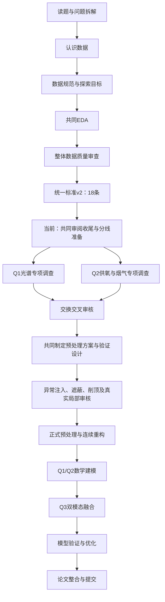

# 完整研究SOP

```mermaid
flowchart TD
 A[读题与问题拆解] --> B[认识数据]
 B --> C[数据规范与探索目标]
 C --> D[共同EDA]
 D --> E[整体数据质量审查]
 E --> F[统一标准v2：18条]
 F --> G[当前：共同审阅收尾与分线准备]
 G --> H1[Q1光谱专项调查]
 G --> H2[Q2供氧与烟气专项调查]
 H1 --> I[交换交叉审核]
 H2 --> I
 I --> J[共同制定预处理方案与验证设计]
 J --> K[异常注入、遮蔽、削顶及真实局部审核]
 K --> L[正式预处理与连续重构]
 L --> M[Q1/Q2数学建模]
 M --> N[Q3双模态融合]
 N --> O[模型验证与优化]
 O --> P[论文整合与提交]
```

调查阶段不能自动进入处理阶段。每个阶段交付含Task ID、来源/哈希、数学依据、参数、证据、局限、替代解释和结论状态；重大决定两名队员确认。检测和重构分别验证；Q3严格记录实时可用信息，按炉考虑泛化。模板存在不代表审核或实验已完成。
